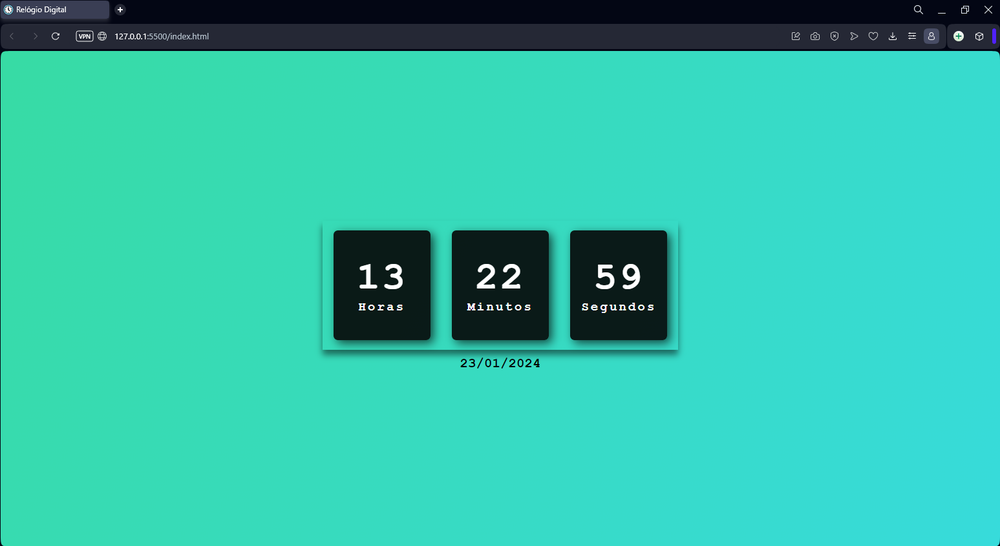

<h1 align="center">Relógio Digital</h1>
 

### 🚨 Sobre o Projeto

Em busca de aperfeiçoar os meus estudos que estou fazendo em HTML, CSS e JavaScript, fiz esse projeto. Um relógio digital, no qual foi utilizado as citadas três tecnologias.

### 🔨 Ferramentas Utilizadas

* [HTML](https://developer.mozilla.org/pt-BR/docs/Web/HTML)
* [CSS](https://developer.mozilla.org/pt-BR/docs/Web/CSS)
* [JavaScript](https://developer.mozilla.org/pt-BR/docs/Web/JavaScript)

### 📽️ Projeto 

</img>